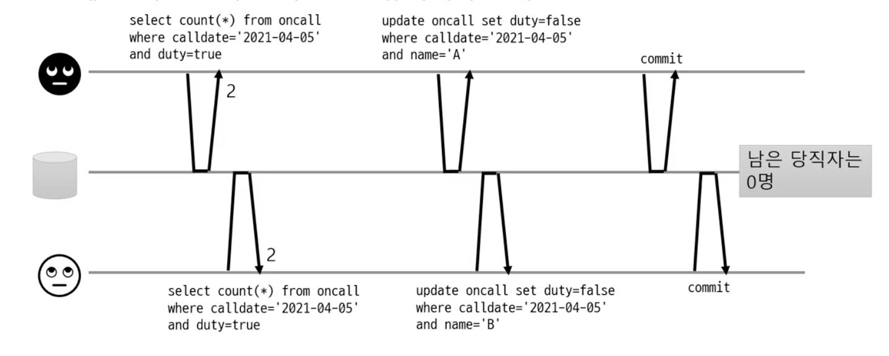
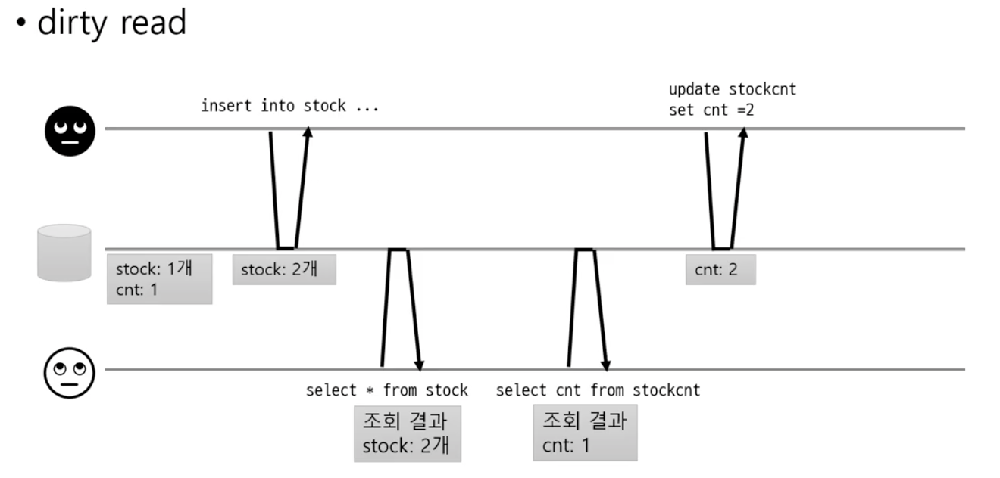
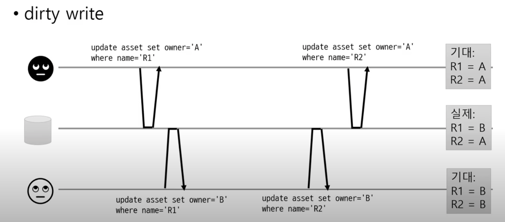
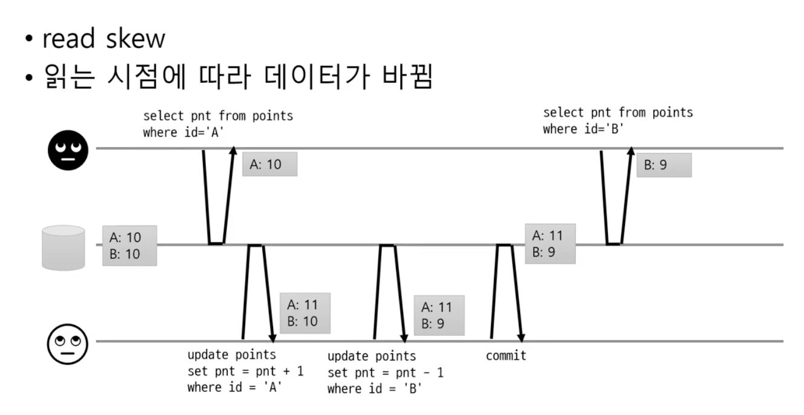
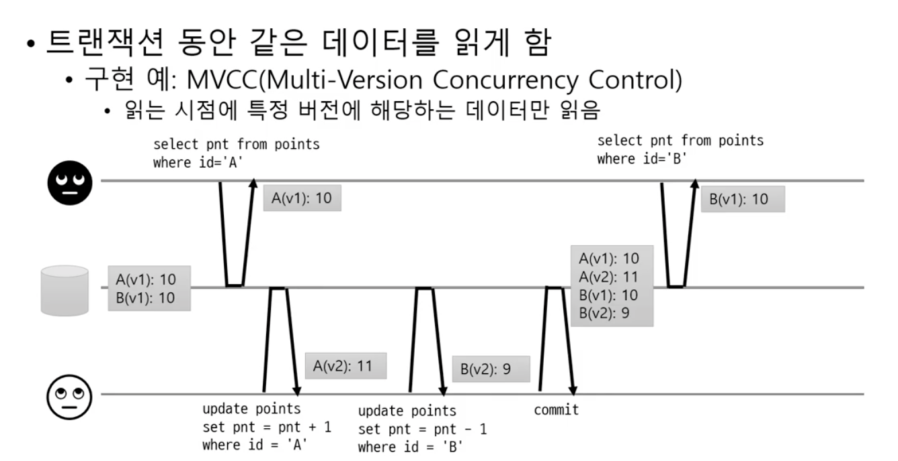
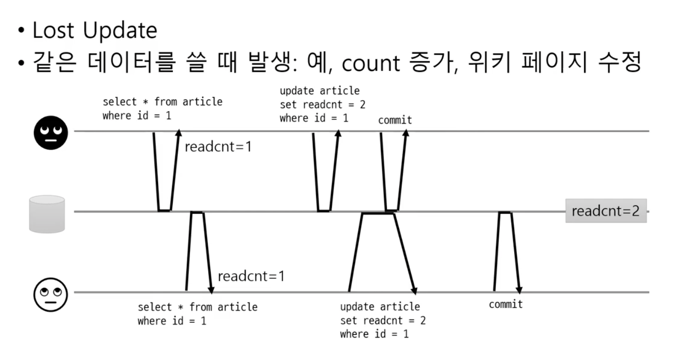
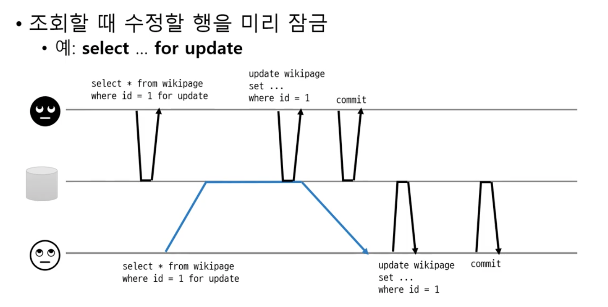
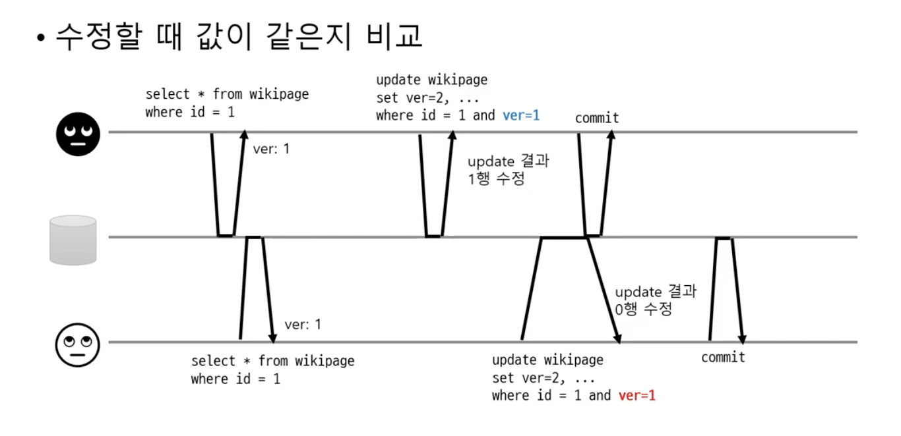
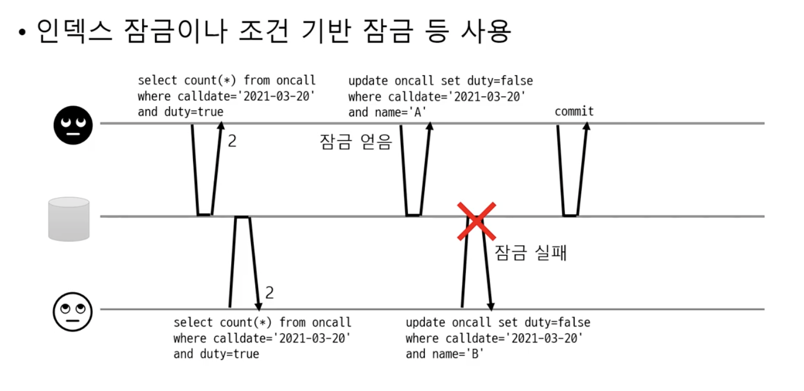

# DB 트랜잭션
- 트랜잭션이란?

여러 읽기/쓰기를 논리적으로 하나로 묶음
- 트랜잭션 시작 - 여러 쿼리 실행 - 커밋 또는 롤백
- 모두 반영(커밋) 또는 모두 반영하지 않거나(롤백)

-> 로직에 문제 발생시 애플리케이션이 데이터 일관성 보장해야 함

- 트랙잭션 범위는 커넥션 기준!

-> 커넥션을 개발자가 관리해야된다. 가능? 으악!

### 대안으로 나온 **트랜잭션 전파!**

- 여러 메서드 호출이 한 트랜잭션에 묶이도록 하기 위해 필요

ex) 스프링 프레임워크의 트랜잭션 처리
-> 메서드 간에 커넥션 객체를 전달하지 않아도 한 트랜잭션으로 묶어서 실행

- 트랜잭션과 외부 연동

외부 연동이 섞여 있으면 롤백 처리에 주의

### 글로벌 트랜잭션
2PC(two-phase commit)

두 개 이상 자원(DB, 메시징큐 등)을 한 트랜잭션으로 처리

- 각 자원이 2PC를 지원해야 함
- 글로벌 트랜잭션 관리자 필요
- 두 개 이상 자원에 대한 트랜잭션 처리가 쉬워짐

(거의) 사용하지 않음
- 성능이 떨어짐, 서비스/마이크로서비스
  
다중 자원에 대한 데이터 처리가 필요하면 다른 수단 고려
- 예, 이벤트/ 비동기 메시징

### 정리
위 내용은 원자성(Atomicity) - **A**CID
- all or nothing

트랜잭션 범위 중요
- 문제가 발생했을 때 롤백해야 하는 범위

## 격리
같은 데이터에 동시 접근

ex. 당직 담당자를 최소 1명 유지해야 한다면? 시나리오



### 경쟁 상태(Race Condition)
- 여러 클라이언트가 같은 데이터에 접근할 때 문제 발생
이 문제를 해결하기 위해, 트랜잭션 격리가 필요하다.

- 트랜잭션 격리(Isolation)
  - 트랜잭션을 서로 격리해서 다른 트랜잭션이 영향을 주지 못하게 함

- 가장 쉬운 방법은 트랜잭션을 순서대로 실행
  - 동시 접근 문제 아예 없음
  - 하지만 한 번에 한 개 트랜잭셩만 처리하므로 성능(처리량) 저하 가능
  
  -> 격리를 문제 사항에 맞게 격리수준을 선택해서 사용한다.

- 다양항 격리 수준 지원
  - Read Uncommitted
  - Read Committed
  - Repeatable Read

### 동시성 관련 다양한 문제들
- 커밋되지 않은 데이터 읽기
- 커밋되지 않은 데이터 덮어쓰기
- 읽은 동안 데이터 변경 1
- 변경 유실
- 읽는 동안 데이터 변경 2

### 커밋되지 않은 데이터 읽기
- dirty read
  


### 커밋되지 않은 데이터 
- dirty write



### Read Committed
더티들의 동작은 위험할 수 있기때문에, Read Committed를 제공한다.

- 커밋된 데이터만 읽기
  - 커밋된 값과 트랜잭션 진행 중인 값을 따로 보관

- 커밋된 데이터만 덮어쓰기
  - 행 단위 잠금 사용
    - 같은 데이터를 수정한 트랜잭션이 끝날 때까지 대기

### 읽는 동안 데이터 변경 1
- read skew
  


### Repeatable Read
- 트랜잭션 동안 같은 데이터를 읽게 함
  - 구현 예 : MVCC(Multi-Version Concurrency Control)



-> MySQL InnoDB엔진, JPA에서 기본인듯(check check)

### 변경 유실
- Lost Update
  
Read Committed와 Repeatable Read 를 사용하더라고 발생할 수 있다.



### 변경 유실에 대한 몇 가지 처리 방법
- 원자적 연산 사용
- 명시적인 잠금
- CAS(Compare And Set)

TODO 키야! 꼭 이 처리들 자세히 정리하기

### 원자적(atomic) 연산
- DB가 지원하는 원자적 연산 사용
  - 동시 수정 요청에 대해 DB가 순차 처리

예) ```update article set readcnt = readcnt+1 where id = 1```

-> DB가 동시적인 요청에대해 순차적으로 처리해준다.

### 명시적 잠금
- 조회할 때 수정할 행을 미리 잠금

보통 select .. for update



> Serializable 과 뭐가 다른걸까?

### CAS연산
- 수정할 때 값이 같은지 비교



### 읽는 동안 데이터 변경 2
- 한 트랜잭션의 결과가 다른 트랜잭션의 쿼리 결과에 영향

논리적으로 분리되야되는 상태

### Serializable
- 인덱스 잠금이나 조건 기반 잠금 등 사용

순차적으로 진행하지는 않고(성능이 너무 떨어지기 때문에) index기반이나, where절 조건을 기반으로 잠금을 설정한다. 



## 정리
- 동시성 문제와 격리 수준을 이해하면 문제 발생을 줄일 수 있음

- 잠금 시간은 최소화
  - 잠금 시간이 길어지면 성능(처리량) 저하

- 동시성 문제를 다룰 때는 다음을 알면 좋음
  - 사용하는 DB의 기본 격리 레벨
  - DB의 격리 레벨 동작 방식(DB마다 동작 방식이 다를 수 있음)

## 출처
- [최범균님의 킹 왕 짱 유튜브 - DB트랜잭션 조금 이해하기 1/2](https://www.youtube.com/watch?v=poyjLx-LOEU)


