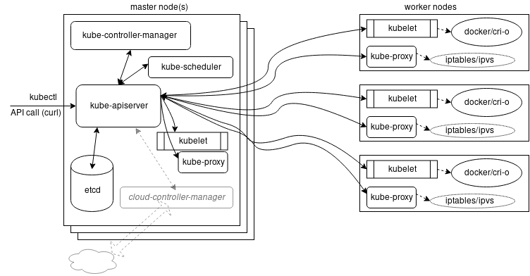

## Installation And Configuration

### Minikube Install!
```curl -Lo minikube https://storage.googleapis.com/minikube/releases/latest/minikube-darwin-amd64```

```chmod +x minikube```

```sudo mv minikube /usr/local/bin```

위 과정이 미니큐브 들고와서 맥북 환경에 세팅하는 과정

이제 터미널에서

```minikube start```

때리면 엄청 이쁜(?) 이모티콘들과 미니큐브 도커 컨테이너가 실행된다.

```kubectl get nodes```

K8S Controller명령어 사용 가능

### Install kubeadm to create a cluster
[참고 사이트](https://kubernetes.io/docs/setup/production-environment/tools/kubeadm/create-cluster-kubeadm/)

kubeadm을 사용하면 모범 사례를 준수하는 최소한의 실행 가능한 K8S 클러스터를 만들 수 있다.

kubeadm은 다음과 같이 필요한 경우에 유용하다.

- 처음으로 Kubernetes를 사용해 볼 수있는 간단한 방법이다.
- 기존 사용자가 클러스터 설정을 자동화하고 애플리케이션을 테스트하는 방법이다.
- 더 넓은 범위의 다른 생태계 및 설치 도구의 구성요소 이다.

kubeadm 노트북, 클라우드 서버 세트, Raspberry Pi 등 다양한 컴퓨터에 설치하고 사용할 수 있다.
클라우드에 배포하든 온 프레미스에 배포하든 관계없이 kubeadm Ansible 또는 Terraform과 같은 프로비저닝 시스템에 통합할 수 있다.

뭔가.. 네트워크 설정이 쏟아진다..

### Installing a Pod Network
K8S 클러스터를 초기화하기 전에 네트워크를 고려해야하며 IP 충돌을 피해야한다.

많은 프로젝트에서 CNCF 프로젝트 인 CNI(Container Network Interface)를 언급한다.. C

- Pod Networking
1. Calico
2. Flannel
3. Kube-Router
4. Romana
5. Weave Net

졸귀탱 고양이 그림인 Calico는 다른분 논문에서 스윽봤으니 저걸쓴다!

### Installation Tools
Chef, Puppet, Ansible, Terraform 등 설정 관리 시스템을 사용할 수 있다.

[K8S 하드 웨이~](https://github.com/kelseyhightower/kubernetes-the-hard-way)

뭔지 모르겠으니 이런게 있다.

- Kubespray
- Kops
- kube-aws
- kubicorn

### 설치 고려 사항

설치 프로세스를 시작하려면 단일 노드 배포로 실험을 시작해야한다.

이 단일 노드는 모든 K8S 구성 요소(ex. API 서버, 컨트롤러, 스케줄러, kubelet 및 kube-proxy)를 실행한다.

minikube로도 예시를 수행할 수 있다.

서버 클러스터 (물리적 또는 가상)에 배포하려는 경유 다른 분산 시스템과 마찬가지로 다양한 선택을 할 수 있다.

- 어떤 공급자를 사용해야하나? 퍼블릭 또는 프라이빗 클라우드? 물리적 또는 가상?

- 어떤 운영 체제를 사용해야하나? K8S는 대부분의 운영체제(Debian, Ubuntu, CentOS 등)와 컨테이너 최적화 OS (CoreOS, Atomic)에서 실행 된다.

- 어떤 네트워킹 솔루션을 사용해야하나? 오버레이가 필요하나?

- 내 etcd 클러스터를 어디에서 실행해야하나?

- 고 가용성 (HA) 헤드 노드를 구성 할 수 있나? 

최상의 옵션을 선택하는 방법은 [공홈시작하기](https://kubernetes.io/docs/setup/) 설명서 페이지를 참조.

systemd가 Linux에서 지배적인 init 시스템이됨에 따라 K8S 구성요소는 대부부의 경우 systemd 단위 파일로 실행된다.

또는 헤드 노드 (kubadm)에서 실행되는 kubelet을 통해 실행된다.

### 주요 배포 구성
높은 수준에서 네 가자 기본 배포 구성이있다.

- 단일 노드
  단일 노드 배포에서는 모든 구성 요소가 동일한 서버에서 실행된다. 이는 K8S에 대한 테스트, 학습 및 개발에 적합하다.

- 단일 헤드 노드, 다중 작업자
  추가 작업자, 단일 헤드 노드 및 다중 작업자를 추가하는 것은 일반적으로 API, 스케줄러 및 컨트롤러 관리자가있는 헤드 노드에서 실행되는 단일 노드 etcd 인스턴스로 구성된다.

- HA가있는 다중 헤드 노드, 다중 작업자
  HA 구성의 다중 헤드 노드와 다중 작업자는 클러스터에 더 많은 내구성을 추가한다.
  API 서버 앞에는 로드밸런서가 있고, 스케줄러와 컨트롤러 관리자는 리더(플래그를 통해 구성됨)를 선택한다.
  etcd 설정은 여전히 단일 노드일 수 있다.

- HA etcd, HA 헤드 노드, 다중 작업자
  가장 진보되고 탄력적인 설정은 HA헤드노드와 다중작업자가있는 HA etcd 클러스터이다.
  또한 etcd는 HA를 제공하고 K8S헤드 노드와 별도의 노드에서 실행되는 진정한 클러스터로 실행된다.

  이 네 가지 방법 중 어떤 것을 사용할 것인지는 K8S여정에서 얼마나 발전했는지와 목표가 무엇인지에 따라 달라진다.

  K8S Federation을 사용하면 고 가용성도 제공된다.
  여러 클러스터가 공통제어 플레인과 함께 결합되어 관리 상 또는 장애후에 한 클러스터에서 다른 클러스터로 리소스를 이동할 수 있다.
  연합에는 몇 가지 문제가 있지만 [v2](https://github.com/kubernetes-sigs/kubefed)가 더 강력한 제품이 될 것이라는 희망이 있다. (머선 소리구,,)

### K8S용 systemd단위 파일
  이러한 구성에서 일부 구성 요소를 표준 시스템 데몬으로 실행한다.

  예를 들어, 여기에서 컨트롤러 관리자를 실행하기위한 샘플 시스템 단위 파일을 볼 수 있다.

  kubeadm을 사용하면 kubelet용 시스템 데몬이 생성되고 나머지는 아래 내용으로 컨테이너로 배포된다.

```
 - name: kube-controller-manager.service
    command: start 
    content: |
      [Unit]
      Description=Kubernetes Controller Manager Documentation=https://github.com/kubernetes/kubernetes
      Requires=kube-apiserver.service
      After=kube-apiserver.service
      [Service]
      ExecStartPre=/usr/bin/curl -L -o /opt/bin/kube-controller-manager -z /opt/bin/kube-controller-manager https://storage.googleapis.com/kubernetes-release/release/v1.7.6/bin/linux/amd64/kube-controller-manager
      ExecStartPre=/usr/bin/chmod +x /opt/bin/kube-controller-manager
      ExecStart=/opt/bin/kube-controller-manager \
        --service-account-private-key-file=/opt/bin/kube-serviceaccount.key \
        --root-ca-file=/var/run/kubernetes/apiserver.crt \
        --master=127.0.0.1:8080 \
...
```

이 내용은 퍼풱트 유닛 파일이 아니다.

게시된 K8S 릴리스 컨트롤러 바이너리를 다운로드하고 실행할 몇 가지 플래그를 설정한다.

각 구성 요소의 구성에 대해 자세히 살펴보면 해당 구성뿐만 아니라 인증, 권한 부여, HA, 컨테이너 런타임 등에 대한 옵션을 비롯한 다양한 기존 옵션에 더 익숙햐잡나더. 

예를 들어, 그 API 서버는 고도로 구성 가능합니다.

[kube-apiserver](https://kubernetes.io/docs/reference/command-line-tools-reference/kube-apiserver/)에 대한 자세한 정보를 제공한다.

### Hyperkube 사용
모든 구성 요소를 유닛 파일에서 일반 시스템 데몬으로 실행할 수 있지만 API 서버, 스케줄러 및 컨트롤러 관리자를 컨테이너로 실행할 수도 있다.

이것이 kubeadm이 하는 일이다.

minikube에서는 이와 비슷한 간편한 all-in-one hyperkube가 있다.

hyperkube는 컨테이너 이미지로 사용가능하다.

hyperkube는 Google에서 호스팅하므로 Docker가 파일을 가져올 위치를 알 수 있도록 새 저장소를 추가해야 할 수 있다.

자시한 내용은 도움말을 참조. 현재 소프트웨어 릴리즈는 https://console.cloud.google.com/gcr/images/google-containers/GLOBAL/hyperkube에서 찾을 수 있음.

아래 설치 방법은 kubelet을 시스템 데몬으로 실행하고 다른 구성 요소(API 서버, 스케줄러, 컨드롤러 등)를 실행하는 방법을 지정하는 매니페스트를 읽도록 구성하는 것이다.

이러한 매니페스트에서는 hyperkube 이미지가 사용된다. kubelet은 그들을 감시하고 그들이 죽으면 다시 시작되는지 확인한다.

이에 대한 느낌을 얻으려면(?!) hyperkube 이미지를 다운로드하고 컨테이너를 실행하여 도움말 사용법을 얻을 수 있다.

```
docker run --rm gcr.io/google_containers/hyperkube:v1.16.7 hyperkube kube-apiserver --help

docker run --rm gcr.io/google_containers/hyperkube:v1.16.7 hyperkube kube-scheduler --help

docker run --rm gcr.io/google_containers/hyperkube:v1.16.7 hyperkube kube-controller-manager --help
```
gc떙에서만 동작하는 듯

### 소스에서 컴파일
[바이너리 버전의 목록 GITHUB](https://github.com/kubernetes/kubernetes/releases)에서 사용할 수 있다.
gcloud, minikube 및 kubeadmin와 함께 K8S 몇 시나리오를 실행할 수 있다.

K8S는 빠르게 컴파일할 수도 있다. GoLang 장점 설명~

```
$ cd $GOPATH

$ git clone https://github.com/kubernetes/kubernetes

$ cd kubernetes

$ make
```
도커 호스트에서, 해야되는 구나

뚜듈뚜듈

## K8S Architecture
- Discuss the main components of a Kubernetes cluster.
- Learn details of the master agent kube-apiserver.
- Explain how the etcd database keeps the cluster state and configuration.
- Study the kubelet local agent.
- Examine how controllers are used to manage the cluster state.
- Discover what a Pod is to the cluster.
- Examine network configurations of a cluster.
- Discuss Kubernetes services.

### 주요 구성 요소
K8S 주요 구성 요소는 다음과 같다.
- Master and worker nodes
- Controller
- Services
- Pods of containers
- Namespaces and quotas
- Network and policies
- Storage

K8S Cluster는 마스터 노드와 워커노드 셋으로 구성된다.

클러스터의 모든 내부 및 외부 트래픽은 컨트롤러 API 호출을 통해 구동된다.

대부분의 프로세스는 컨테이너 내에서 실행된다.



### Master Node
K8S 마스터 클러스터에 대한 다양한 서버 및 관리자 프로세스를 실행한다.

마스터 노드의 구성요소 중에는 kube-apiserver, kube-scheduler 및 etcd 데이터베이스가 있다.

소프트웨어가 성숙됨에 따라 클라우드 컨트롤러 관리자와 같은 전용 요구 사항을 처리하기 위해 새로운 구성요소가 생성되었다.

타사 클러스터 관리 및 보고를 위해 Rancger또는 DigitalOcean과 같은 다른 도구와 상호작용하기 위해 kube-controller-manager가 처리 한 작업을 처리한다.

DNS 서비스와 같이 일반적인 프로덕션 클러스터에 필수적인 몇가지 추가 기능이 있다. 

다른 것은 K8S가 클러스터 수준 로깅 및 리소스 모니터링과 같은 로컬 구성 요소를 아직 개발하지 않은 타사 솔루션이다.

개념적으로 클러스터의 현재 상태를 원하는 상태와 일치시키는 것을 담당하는 다양한 포드를 Controll-plain이라고 한다.

kubeadm을 사용하여 클러스터를 구축 할 때 kubelet 프로세스는 systemd에서 관리한다. 한번 실행되면, 이는 모든 pod는 ```/etc/kubernetes/manifests/.```에서 찾을 수 있다.

- kube-apiserver
KUBE-apiserver는 는 Kubernetes 클러스터의 운영의 핵심입니다. 내부 및 외부 트래픽의 모든 통화는이 에이전트를 통해 처리됩니다. 이 에이전트는 모든 작업을 수락하고 유효성을 검사하며 이는 etcd 데이터베이스에 대한 유일한 연결 입니다. API 개체 및 서비스 REST 작업에 대한 데이터의 유효성을 검사하고 구성합니다. 결과적으로 전체 클러스터에 대한 마스터 프로세스 역할을하고 클러스터 공유 상태의 프런트 엔드 역할을합니다.

v1.16의 알파 기능으로 시작하면 사용자 시작 트래픽과 서버 시작 트래픽을 분리 할 수 ​​있습니다. 이러한 기능이 개발 될 때까지 대부분의 네트워크 플러그인은 성능, 용량 및 보안에 영향을 미치는 트래픽을 혼합합니다.

- kube-scheduler
KUBE 스케쥴러는 컨테이너의 포드를 호스팅하는 노드를 결정하는 알고리즘을 사용한다. 스케줄러는 바인딩 할 사용 가능한 리소스 (예 : 볼륨)를 확인한 다음 가용성 및 성공에 따라 포드 배포를 시도하고 재 시도합니다. 알고리즘에 영향을 줄 수있는 여러 가지 방법이 있으며 대신 사용자 지정 스케줄러를 사용할 수 있습니다. 다른 설정으로 인해 Pod가 보류 상태로 남아있을 수 있지만 Pod를 특정 노드에 바인딩 할 수도 있습니다. 참조 된 첫 번째 설정 중 하나는 현재 할당량 제한 내에서 포드를 배포 할 수 있는지 여부입니다. 그렇다면 적절한 배치를 결정하기 위해 pod의 taint 및 허용치, Pod의 라벨이 노드의 라벨과 함께 사용됩니다.

스케줄러에 대한 자세한 내용은 GitHub에서 찾을 수 있습니다 .

### Worker Nodes
모든 노드는 kubeket 및 kube-proxy는 물론 Docker 또는 cri-o와 같은 컨테이너 엔진을 실행한다.

이러한 에이전트를 감시하거나 아직 K8S에 포함되지 않은 서비스를 제공하기 위해 다른 관리 데몬이 배포된다.

kubelet은 모든 노드에 설치된 기본 Docker Engine과 상호작용하며 실행해야하는 컨테이너가 실제로 실행 중인지 확인한다.

kube-proxy는 컨테이너에 대한 네트워크 연결을 관리한다.

iptavles 항목을 사용하면 된다. 또한 프록시 트래픽과 ipv의 알파 기능을 사용하는 임의 포트를 사용하여 서비스 및 엔드 포인트를 모니터링하는 사용자 공간 모드도 있다.

Docker엔진의 대안인 cri-o 등의 엔진을 실행할 수도 있다.

supervisord는 기존 Linux 환경에서 다른 프로세스를 모니터링하고 알리는 데 사용되는 경량 프로세스 모니터이다.

non-systemd 클러스터에서는 이 데몬을 사용하여 kubelet 및 docker 프로세스를 모두 모니터링할 수 있다.

실패하면 다시 시작하고 이벤트를 기록한다.

일반 설치의 일부는 아니지만 일부는 추가보고를 위해 이 모니터를 추가할 수 있다.

K8S에는 아직 클러스터 전체 로깅이 없다.

대신 Fluend라는 다른 CNCF 프로젝트가 사용된다.

구현되면 클러스터에대한 통합 로깅 계층을 제공하여 메시지를 필터링, 버퍼링 및 라우터링한다.

클러스터 전체 메트릭은 기능이 제한된 또 다른 영역이다.

메트릭 서버 SIG는 기본 노드 및 포트 CPU 및 메모리 사용률을 제공한다.

더 많은 메트릭을 위해 많은 사람들이 Prometheus 프로젝트를 사용한다.

### Service


