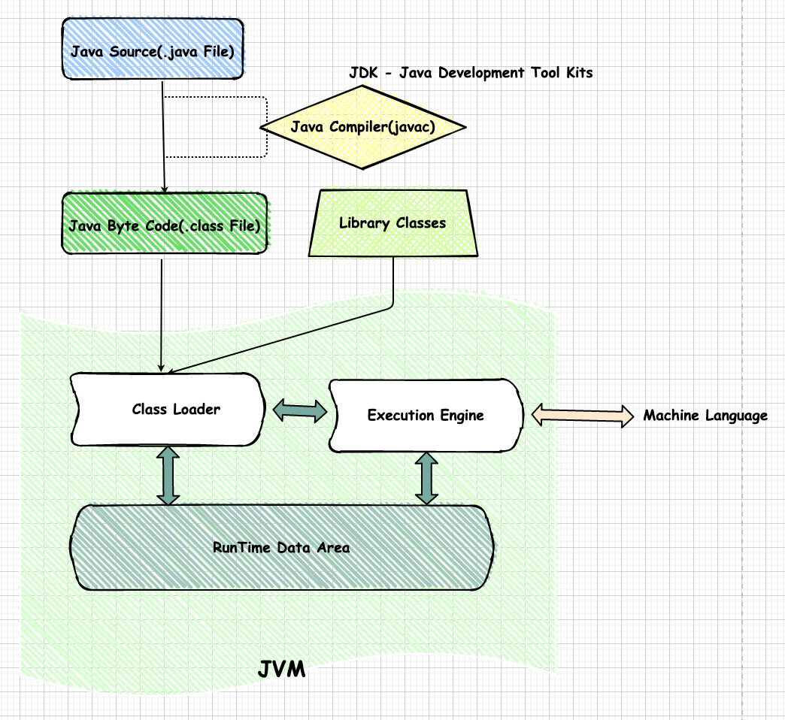
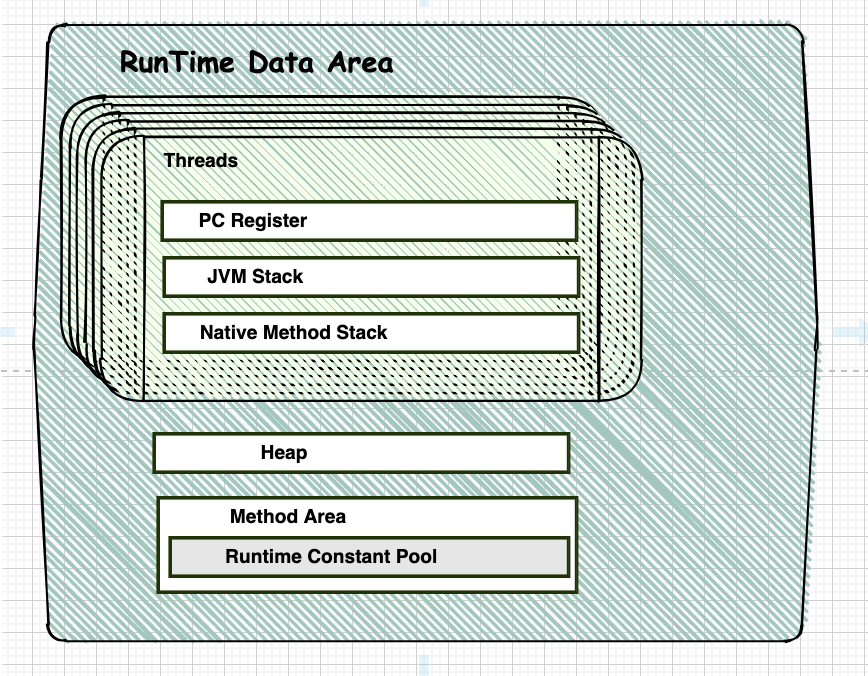
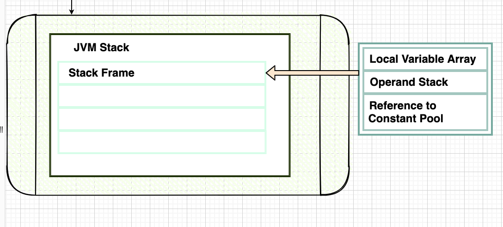
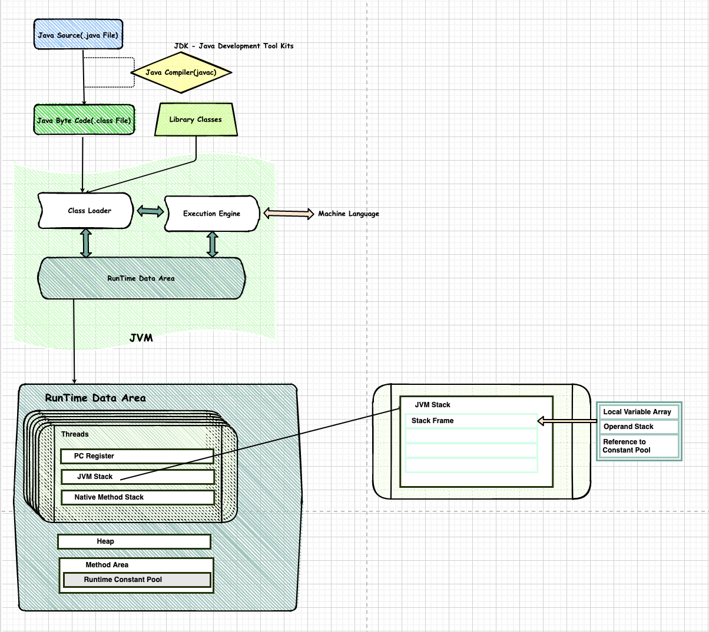

# 1 주차 :: JVM은 무엇이며 자바 코드는 어떻게 실행하는 것인가

> > 삶은 책임지는 것에서 시작된다. 당신은 혼자 매 순간의 삶과 자신의 모든 행동에 대해 책임을 져야 한다.

1. JVM이란 무엇인가
2. 컴파일 하는 방법
3. 실행하는 방법
4. 바이트코드란 무엇인가
5. JIT 컴파일러란 무엇이며 어떻게 동작하는지
6. JVM 구성 요소
7. JDK 와 JRE 의 차이

## 1. JVM이란 무엇인가
    JVM(Java Virtual Machine, 자바 가상 머신)
    JVM은 자바 바이트코드를 실행할 수 있는 주체이다.
    일반적으로 인터프리터나 JIT컴파일 방식으로 다른 컴퓨터 위에서 바이트코드를 실행할 수 있도록 구현되나 
    jop 자바 프로세서처럼 하드웨어와 소프트웨어를 혼합해 구현하는 경우도 있다.
    JVM은 OS에 종속적 -> OS별로 JVM 설치해야됨(플랫폼 종속적). 
    JVM은 Java Class(.class 확장자로 컴파일된 자바바이트코드) OS와 독립적으로 실행할 수 있게 해준다. -> 플랫폼 독립적
    모든 JVM은 JVM 규격에 정의된 대로 자바 바이트코드를 실행한다. 따라서,
    표준 자바 API까지 동일한 동작을 하도록 구현한 상태에서는 이론적으로 모든 자바 프로그램은 CPU 나 운영 체제의 종류와 무관하게 동일할 것을 보장한다.
    JVM역할은 자바 애플리케이션을 클래스 로더를 통해 읽어들여 메모리에 적재하고, 자바 API와 함께 실행하는 것이다.
    JVM은 메모리관리, GC(Garbage Collection) 수행

> [자바 프로세서](https://ko.wikipedia.org/wiki/%EC%9E%90%EB%B0%94_%ED%94%84%EB%A1%9C%EC%84%B8%EC%84%9C)

### [특성](https://ko.wikipedia.org/wiki/%EC%9E%90%EB%B0%94_%EA%B0%80%EC%83%81_%EB%A8%B8%EC%8B%A0) :monocle_face: 
    
     제임스 고슬링이 파스칼의 p-코드, 스몰토크 VM에 영향을 받았다고 했다.
     이 두 가상머신처럼 JVM은 스택 기반이어서 대다수의 명령어가 스택 선두에서 피연산자를 택하고 결과는 다시 스택에 넣는다. 
     스택 상의 피연산자 타입을 구분하고 명령어 스택 상의 피연산자 타입을 기술하는 면에서 p- 코드와 유사하며, 가비지 컬렉션을 사용하고 객체와 메서드 호출 개념이 있다는 점에서 스몰토크 가상 머신의 영향을 받았다고 볼 수 있다.

     JVM의 특성은 다음과 같다
     - 스택 기반의 가상 머신
     - 단일 상속 형태의 OOP을 가상머신 수준에서 구현
     - 포인터를 지원하되 C와 같이 주소 값을 임의로 조작이 가능한 포인터 연산 불가능
     - GC사용
     - 모든 기본 타입의 정의를 명확히 함으로써 플랫폼 독립성 보장
     - 데이터 흐름 분석에 기반한 자바 바이트코드 검증기(verifier)를 통해 스택 넘침, 명령어 피연산자의 타입 규칙 위반, 필드 접근 규칙 위반, 지역 변수의 초기화 전 사용 등 많은 문제를 실행 전에 검증하여 실행 시 안전을 보장하고 별도의 부담을 줄여줌
     - 명령어에서 스택에서 가져올 피연산자의 타입을 명령어에 지정(정수 덧셈 iadd, 단정밀도 실수 덧셈은 fadd)

### 분류
    현재 사용되고 있는 자바 가상 머신 규격은 크게 네가지로 나뉜다. 
    참고로 자바 플랫폼은 자바 SE, 자바 EE, 자바 ME, 자바 카드로 구분되나 자바 가성 머신 규격은 이 분류와 일치하지는 않는다.

> [자바 플랫폼](https://ko.wikipedia.org/wiki/%EC%9E%90%EB%B0%94_(%EC%86%8C%ED%94%84%ED%8A%B8%EC%9B%A8%EC%96%B4_%ED%94%8C%EB%9E%AB%ED%8F%BC))
    
### 구현
    JVM은 자바 플랫폼의 주요한 부분이며, 대부분의 운영체제는 물론 웹 브라우저 등 여러 플랫폼에 설치되어 사용될 수 있으며
    , 휴대전화나 가전기기에도 설치할 수 있다. 따라서 자바 플랫폼은 여러 플랫폼을 지원하며 미들웨어로서의 역할과 플랫폼 스스로의 역할을 동시에 수행할 수 있다.

> [자바 가상머신 규격](https://www.oracle.com/java/technologies/)

## 2. 컴파일 하는 방법
    개발자들이 작성한 .java확장자의 Java 소스코드를 Java Complier를 통해 .class 확장자의 자바 바이트코드를 생성한다. 요즘 IDE들은 Java 소스코드를 [command] + [s] (window :: [ctrl] + [s]) 키를 눌르거나, 저장할때 또는 타이핑을 치고나서 약간의 시간이 지나면 컴파일을 자동 해준다. 수동으로 컴파일을 하고 싶을때에는 terminal이나 cmd 등에서 javac명령어를 통해 Java 소스코드를 컴파일 할 수 있다.
    javac 는 JDK(Java Development Kit에 포함된 개발 지원 도구이다)
    
## 3. 실행하는 방법 :thought_balloon:
    .class 확장자의 자바 바이트코드는 클래스 로더에 의해 JVM내에 로드되고,
    JVM의 바이트코드 검증기(verifer :: 클래스 로딩 시점에 동작하는 것으로 알고있음.)인터프리터와 실행엔진에 의해 기계어로 해석되어 실행된다.
    JVM의 인터프리터는 클래스로딩 영역(바이트코드를 JVM 메모리에 올리기위한 작업)과 실행엔진에서 
    JIT(Just In Time) Compiler와 런타임 시스템에 기계어 변환시 동작하는 인터프리터가 있다.

> 수업시간에 배운내용을 끌어내서 정리중 정확한 자료를 링크를 첨부하자!  

    자바는 동적으로 클래스를 읽어오므로, 프로그램이 싱행 중인 런타임에서야 모든 코드가 JVM과 연결된다.
    이렇게 동적으로 클래스를 로딩해주는 것이 클래스 로더(Class Loader)이다.

    JVM에서 Runtime Data Area의 Heap영역과 Stack영역을 이해하는 것은 개발자에게 매우 중요한 일인것같다. 
    (static 클래스, 변수들은 JVM Class Loading 마지막 시점에서 Runtime Data Area의 Method Area에 초기화되어 적재된다.)
    이번 정리를 통해 손수 그림을 그려보며, 다시한번 메모리구조를 머리속에 넣는 좋은 시간이였다.

 
## 4. 바이트코드란 무엇인가
    자바 소스코드를 JVM이 이해할 수 있는 언어가 자바 바이트 코드이다. 
    자바 컴파일러에 의해 변환되는 코드의 명령어 크기가 1바이트라서 자바 바이트코드라고 불리고 있다.

## 5. JIT 컴파일러란 무엇이며 어떻게 동작하는지
    JIT(Just In Time) Compiler란 런타임시 실제 기계어로 변환해주는 컴파일러를 의미한다. 
    동적 번역(dynamic translation)이라고도 불리는 이 기법은 프로그램의 실행 프로그램의 실행 속도를 향상시키기 위해 개발되었다.
    
### Excution Engine에서 인터프리터와 JIT 컴파일러
    
    인터프리터는 바이트코드 명령어를 하나씩 읽어 해석하고 실행한다. 
    하나의 해석은 빠르나 결과의 실행은 느리다는 단점이있다.
    그래서 JIT컴파일러의 도움을 받아 중복 구문을 캐싱해 중복코드에대한 해석을 빠르게 도와준다.
    JIT컴파일러는 적절한 알고리즘을 통해 바이트코드를 컴파일하여 네이티브 코드로 변경 후 캐시에 저장한 후 직접실행하는 방식이다. 

    JIT컴파일러가 컴파일하는 과정은 인터프리터 작업보다 오래 걸리므로,
    만약 한 번만 실행되는 코드라면 컴파일하지 않고 인터프리팅하는것이 효율적이다.
    그래서 JVM 벤더들은 내부적으로 해당 메서드가 얼마나 자주 수행되는지 체크하고,일정 정도를 넘는 경우에만 컴파일을 수행한다.

## 6. JVM 구성 요소

## 7. JDK 와 JRE 의 차이
- JDK(Java Development Tool Kits)는 개발도구인 ***javac***, java, jdb, appletviewer, javah, jar, rmi 와 JRE가 포함되어있다.
  
- JRE(Java Runtime Environment)는 자바 애플리케이션 실행시 필요한 Class Loader, Byte Code Verifier, Java API, Runtime Libraries와 JVM이 포함되어있다.
  
    JRE와 JVM의 Class Area영역이 헷갈릴 수 있는데, 겹치는 부분이 있다.
    Dynamic Class Loading 개념과 함께보면 더 재밌을 수 있다.

## +a JVM Stack per Thread

    JVM 스택은 각 스레드마다 하나씩 존재하며 스레드가 시작될 때 생성된다. 
    스택 프레임이라는 구조체를 저장하는 스택으로, JVM은 오직 JVM 스택에 프레임을 추가하고(push) 제거하는(pop) 동작만 수행한다.
    
    예외 발생 시 printStackTrace() 등의 메서드로 보여주는 Stack Trace의 각 라인은 하나의 스택 프레임을 표현한다.

### 참고 사이트
- [자바가상머신,JVM이란 무엇인가?](https://asfirstalways.tistory.com/158)
- [JVM Wiki](https://ko.wikipedia.org/wiki/%EC%9E%90%EB%B0%94_%EA%B0%80%EC%83%81_%EB%A8%B8%EC%8B%A0)
- [oracle java technologies](https://www.oracle.com/java/technologies/)
- [tcpschool 자바 시작하기](http://tcpschool.com/java/java_intro_programming)
- [IT 인생 - JVM의 구조](https://odol87.tistory.com/5)