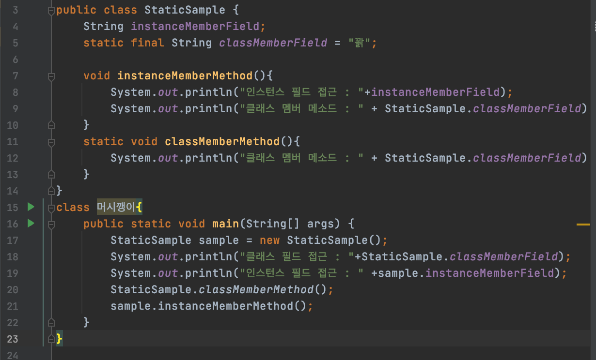
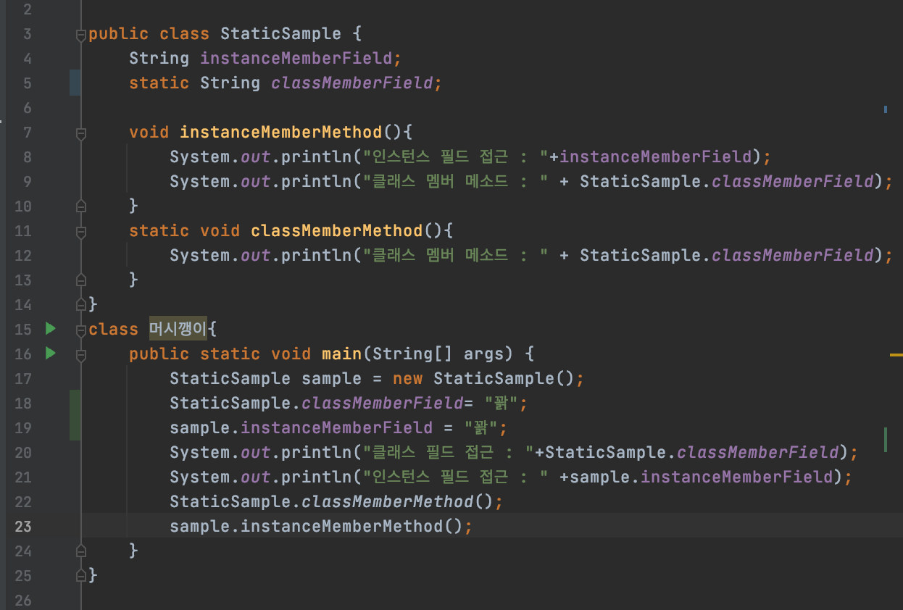
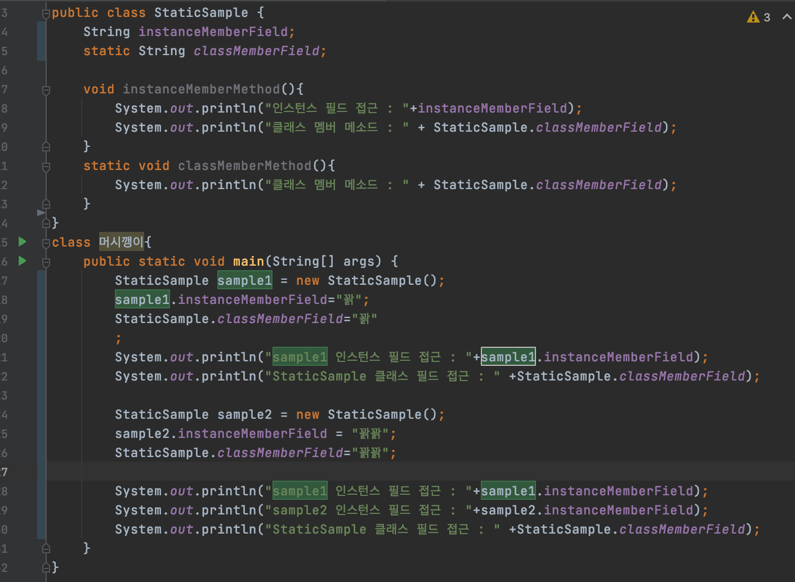
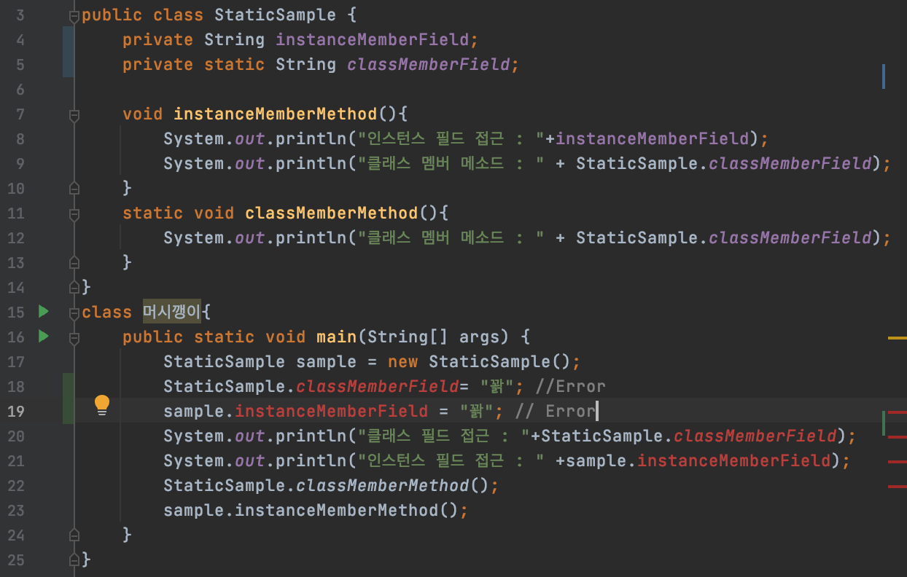
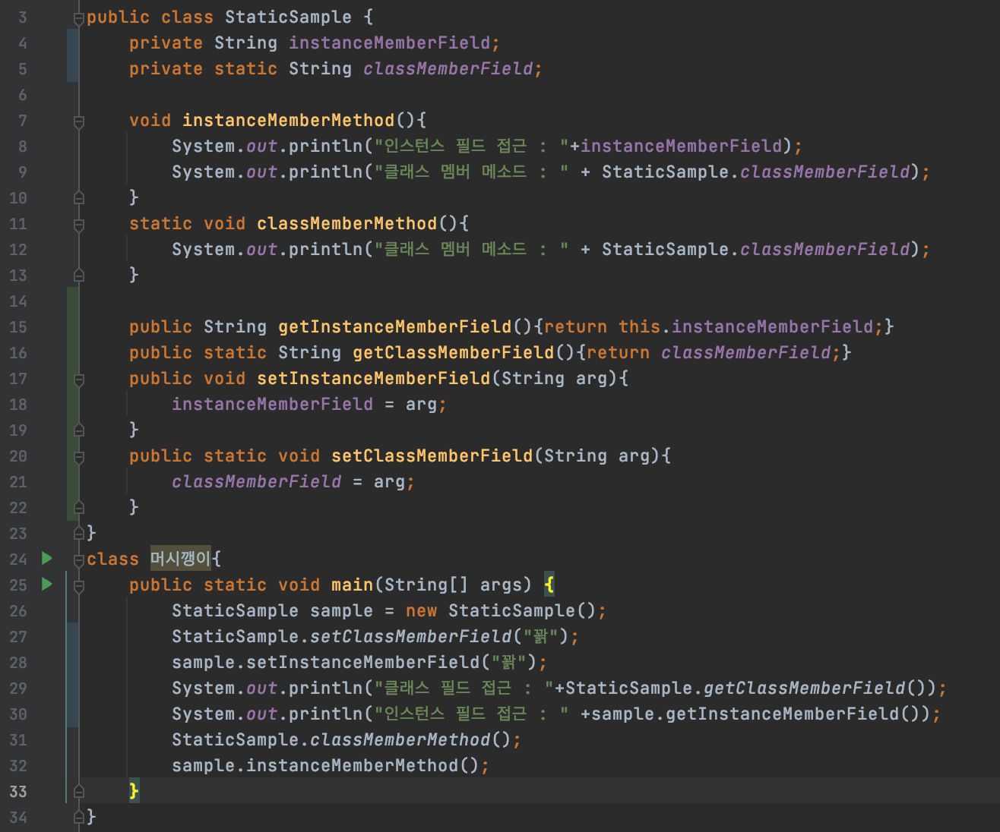

# :ledger: 2주차 - 자바 객체지향 프로그래밍
안녕하세요. 멘토 Duck Typing입니다.

**자바 객체지향 프로그래밍**은 잘 정리되셨나요?

아주 어려운 객체지향이라는 것을 맛보셨는데, 어떠신가요? :dizzy_face:

0과 1로 된 컴퓨터의 언어를 인간이 알아 볼 수 있는 형태로 작성할 수 있게 프로그래밍 언어를 설계했습니다. 

하지만 0과 1로 바뀔 수 있어야 하기때문에, 프로그래밍언어도 컴파일러와 인터프리터 등 기계어 변환기가 알아볼 수 있도록 문법에 맞춰서 오류가 없게 잘~ 작성해야합니다. :floppy_disk:

여러분들이 소프트웨어 기술을 사용하고 있다는 것은 이미 거인의 어깨위에 올라타서, 아름다운 부분만 보고있는 것입니다. 

우리는 컴퓨터의 구조를 알지 못해도, OS의 구조와 동작 알고리즘을 몰라도, C언어를 알지 못해도, 현재쓰고있는 프로그래밍언어가 어떻게 동작하고, 어떻게 0과 1로 바뀌어 흘러가는지 몰라도 코딩을 할 수 있습니다. 

하지만 언제까지 몰라도 될까요? :computer: :neckbeard:

---

우리가 만들고자하는 프로그램을 효과적으로 만들기위한 몇가지 패러다임이 있습니다. 

대표적으로 [PP](https://ko.wikipedia.org/wiki/%EC%A0%88%EC%B0%A8%EC%A0%81_%ED%94%84%EB%A1%9C%EA%B7%B8%EB%9E%98%EB%B0%8D)(Procedural Programming), [OOP](https://ko.wikipedia.org/wiki/%EA%B0%9D%EC%B2%B4_%EC%A7%80%ED%96%A5_%ED%94%84%EB%A1%9C%EA%B7%B8%EB%9E%98%EB%B0%8D)(Object Oriented Programming), [FP](https://ko.wikipedia.org/wiki/%ED%95%A8%EC%88%98%ED%98%95_%ED%94%84%EB%A1%9C%EA%B7%B8%EB%9E%98%EB%B0%8D)(Functional Programming) 등 이 있습니다. (PP, OOP, FP 글자를 눌려 wiki 링크에 들어가셔서 글을 읽어보세요!)


Java는 대표적인 OOP 프로그래밍을 위한 프로그래밍 언어입니다. 버전이 올라감에 따라서 함수형 프로그래밍의 패러다임을 조금씩 수용해서 API들이 추가되고 변경되는 부분이 있습니다. 

그래서 자바의 버전이 참 중요하죠~ (API변경 뿐만아니라 JVM 성능 변화등 다른 이유도 있습니다.) 

 개발자로써 일을 하려면 어떤 패러다임을 공부해야 하냐구요? 하하. 다- 아셔야합니다. :grin:

  많은 개발자들이 OOP프로그래밍을 설계하면서 케이스 별로 패턴 찾고 그에 맞는 디자인을 설계 함으로써 프로그래밍을 했을 때 효과적이였고, 많은 개발자들이 사용하고 토론하면서 검증된 패턴들이 많습니다. 수업을 통해 배운 '싱글톤 패턴' 또한 이런 디자인 패턴 중 하나인데요! 이 좋은 패턴들을 모아서 정리한 유명한 책이 있죠. :closed_book: [GoF Design Patter](https://en.wikipedia.org/wiki/Design_Patterns) 프로그래밍 패러다임과 디자인패턴은 너무 중요해서 제가 더 할말이 없습니다. 정보처리기사에서 문제로 출제될 수 도있고, 면접에서도 자주나오니, 꼭 정리해보세요! 공부한 만큼 자신의 것이 되니까요!

 오랜 기간동안 어떻게하면 프로그래밍을 효과적으로 할 수 있을까? 라는 생각은 수 많은 프로그래머들이 노력해 왔고, 앞으로도 계속될 것입니다. 
 
 소프트웨어니까, 아주 빠르고 유동적으로 변화하니까 꾸준히 공부하는 습관도 개발자에겐 중요합니다! 
 
 
 여러분들도 자동차관련한 프로그램을 어떻게 설계해야 할까? 쇼핑몰은 어떤 클래스들이 어떻게 디자인 해야할까? 끊임없이 생각해보시면서 프로그래밍의 감각을 익혀보세요. :smile:

---

###  Index :: 클릭하면 해당 목차로 뿅~!
1. [클래스](#class)
2. [접근제어자](#접근제어자)
3. [배열](#접근제어자)
4. [컬렉션](#collection)
5. [추가자료](#추가-자료)
6. [참고자료](#참고-자료)

#### Class
클래스란 무엇일까요?

클래스는 객체지향 프로그래밍(OOP)에서 객체를 생성하기 위한 상태(state)와 행동(behavior)을 정의하는 일종의 설계도입니다.

OOP의 객체의 설계 목적은 오직 **재사용**에 있습니다.

어떻게하면 개발자가 원하는 메커니즘대로 최적화해서 재사용할지 고민할 수 있는 기본 구조입니다.

클래스 설계는 물리적일 수도 있고 개념적일 수도 있습니다. 어렵죠? 계속 애플리케이션을 만들어보면서 감각을 익히시면 됩니다~ :yum:

객체지향의 4대 특성이있습니다. 신입개발자 면접에도 자주나오고, 정보처리기사에도 종종 등장하는 4대 특성은 암기하셔야 됩니다.

1. 추상화
2. 캡슐화
3. 상속
4. 다형성

객체지향의 4대 특성을 잘 활용해서 재사용성이 좋은, 개발 및 유지보수를 더욱 효과적으로 쉽게 할 수 있어야 합니다.


- 클래스의 멤버

여러분들의 질문을 쭉 보면서 헷갈려하시는 부분을 정리해보겠습니다. 이부분도 암기하셔야 됩니다.

1. 필드(Field) : 필드는 클래스 객체의 상태 속성을 나타내며, 클래스 멤버 변수라고 불린다. 
    - 인스턴스 변수 : 인스턴스가 갖는 변수이다. 객체생성 (= 인스턴스화)할때 메모리가 생성 및 할당됩니다. 
    - 클래스 변수 : static 키워드가 인스턴스 변수 앞에 붙으면 클래스 변수이다.


 2. 메소드(Method) : 메소드는 객체의 행동을 나타냅니다. 메소드의 특징은 파라미터를 표시한다는 점인데요! 자바에서 메소드를 함수라고 부르지 않습니다. :dizzy_face:
    - 인스턴스 메소드 : 인스턴스 변수와 비슷하다.
    - 클래스 메소드 : 역시 static 키워드가 붙어있다. 


 > stack 메모리는 무엇일까요? heap영역은 어디죠? static키워드가 붙으면 stack,heap 이외의 다른 메모리영역에 저장되는데, 그곳은 어디일까요? 
 
 어려운 내용입니다. 바로 이해한다면, 당신은... 천재?!

 [JVM구조와 자바 런타임 메모리 구조 (자바 애플리케이션이 실행될 때 JVM에서 일어나는 일, 과정을 설명해줄 수 있나요?)](https://jeong-pro.tistory.com/148)

예시 코드를 볼까요?



> 위 코드에서 classMemberMethod()에서 ```System.out.println("인스턴스 필드 접근 : "+instanceMemberField);``` 코드를 작성할 수 있을까요?

필드에 값을 대입해 볼까요?



static field예제를 볼까요?



> sample1, sample2의 인스턴스 필드들은 각자의 heap메모리를 차지하고있어 각자 필드에 데이터를 저장하지만 static필드는 클래스와 연결된 static영역에 1개의 데이터를 저장합니다. 이 말은 어디선가 특정 클래스의 static필드를 수정한다면, 그 클래스를 사용하는 모든 static필드의 값이 변경된다는 뜻입니다.

- 클래스의 생성자

생성자는 독특한구조입니다. 자바의 메소드는 return타입이 반드시 명시되야하지만, 생성자는 return타입이 없어야합니다. 또, 클래스와 이름이 똑같아야됩니다.

생성자의 호출은 new 키워드와 함께 사용되며, 클래스가 생성자를 통해 **객체생성** (= 인스턴스화)됩니다.

:fish::fish:

**클래스**라는 붕어빵틀에 **객체생성**(=인스턴스화)를 통해 붕어빵들이 계속 나오는 것처럼요!

계속 나오는 메모리 구조~ 너무 어렵죠? JVM의 구조를 그려보면서 내가 작성한 코드가 메모리에 어떻게 올라가는 지, 항상 상상하시면서 고민하시면서, 자신의 생각했던 결과와 다른 결과가 나왔을 때. 

반드시 멘토에게 질문을 남겨보세요. :innocent:

너무 어렵다면, 나중에 천천히 생각해보셔도 됩니다. :punch:

### 접근제어자
접근제어자(Access modifier)란 클래스와 클래스 멤버(멤버가 뭔지 모르시면 안됩니다!!)의 선언 시 사용하는 키워드!

객체 지향 프로그래밍에서 정보 은닉(Data hiding)을위해 사용합니다.

설계과정에서 객체접근(.)시 최소한의 정보만 노출해서 프로그램의 안정성 유지보수성을 높이려는 노오력입니다.

객체지향의 4대 특성을 정리하시면서 앞으로 배울 private필드와 getter/setter의 의미를 생각해봅시다.

자바에서는 4가지 접근 제어자를 제공합니다.
1. private
2. pulic
3. default
4. protected

클래스 필드 예제에서 private접근 제어자를 써볼까요?



어휴! 빨갛게 에러표시가 엄청납니다. 필드에 어떻게 접근해야할까요?



느낌이 오시나요? .으로 필드에 접근하기보다 메소드를 이용해서 필드에 접근했을 때, 부가적인 처리 (예를 들어 갯수는 음수가 나오면 안되는데, 음수값이 들어왔을때 0으로 처리하는 로직 추가)를 함으로써 필드 데이터를 보호할 수 있고.

필드에 접근하는 메소드이름을 의미있게 지음으로써 필드변수명을 노출 시키지 않고 보안성을 높일 수 있습니다. 

접근제어자를 그림으로 잘 설명해주신 사이트 추천 들어갈께요!! :satisfied:

[TCP School Access Modifier](http://www.tcpschool.com/java/java_modifier_accessModifier)

### Array
여러값을 담을 수 있는 배열의 특징과 주의점 알아볼까요?

1. 배열의 길이는 고정되어 있다.
2. 배열의 값은 Index로 접근할 수 있다.
3. 배열의 길이 접근은?
4. 빈번한 배열의 오류??  :broken_heart:

배열은 객체입니다. Primitive Type이 아닌 모든 값들은 Referrence Type이라고 생각하셔도 문제없습니다.

가끔 앱사용하다가 ArrayIndexOutOfBoundException 창뜨시는걸 본적있으신가요?

배열을 사용하면, 저 에러가 참 많이나서 꼭, 배열의 길이를 체크하고 프로그래밍해야 정신 건강에 좋습니다!

배열의 예시를 볼까요?

```
String[] weeks = {"월", "화", "수", "목", "금", "토", "일"};
for (int i=0; i<weeks.length; i++) {
    System.out.println(weeks[i]);
}

System.out.println(weeks[7]); // ArrayIndexOutOfBoundException! 발생
```

참고 사이트입니다.

[점프투 자바](https://wikidocs.net/206)

### Collection
오잉 왠 Collection? 이게 뭐지?

여러분들 배열을 배우고 ArrayList 를 사용해보셨는데요.

배열은 길이가 고정되어있어서 ArrayIndexOutOfBoundException이 아주 자주 발생합니다. 배열을 사용하다가 실수로 ArrayIndexOutOfBoundException을 발생시키면 프로그램의 안정성이 떨어질 수 있죠.

또, 배열은 고정된 길이에 맞춰 메모리를 할당합니다.

알고리즘이라고 들어보셨나요? 컬렉션 프레임워크는 메모리할당에 있어서 배열과는 다른 최적화된 메커니즘을 사용합니다. 메모리를 효과적으로 사용하기 위해서 자바에서 컬렉션 프레임워크(Collection Framework) API를 기본적으로 제공합니다.

컬렉션 프레임워크는 데이터를 효과적으로 처리할 수 있는 표준화된 방법을 제공하는 클래스의 집합입니다. 최적화도 이미 되어있고, 여러분은 사용하려는 데이터 배열이 고정적인지, 변경과 삭제가 빈번한지 판단해서 잘 선택해서 사용하시면 됩니다.

좀더 알고 싶으신분들은 [TCP School Collection Framework](http://www.tcpschool.com/java/java_collectionFramework_concept)를 참고해주세요.

얼마나 중요하냐고요? 프로그래밍은 잘하고싶으시다면 찐으로 공부하셔야합니다. :green_heart:


### 추가 자료 
업데이트가 늦을 수 있습니다.:beginner:
멘토가 많이 바쁩니다. :joy:

:airplane: [자바 클래스](./../../JavaStudy-WhiteShip/Week5-Class/README.md/README.md)

### 참고 자료
- [TCP School - Java](http://www.tcpschool.com/java/intro)
- [어느 집착형 공부러의 소름돋는 정리](https://blog.naver.com/hsm622/222144931396)

--- 

OOP를 배우면서 클래스파일이 여러개가 쓰이게되고 이제 프로그래밍이 복잡해 질탠데요.

질문주실때 캡처한 한장의 소스로 파악하기 힘든경우가 많습니다~ :trollface:

Git공부는 하고 계신지요. :telephone_receiver:

[생활코딩 Git](https://opentutorials.org/course/3837)

Git을 사용해서 GitHub 사이트에 소스를 올리시면 포트폴리오 참고가능 및 효과적인 질문을 할 수 있습니다!