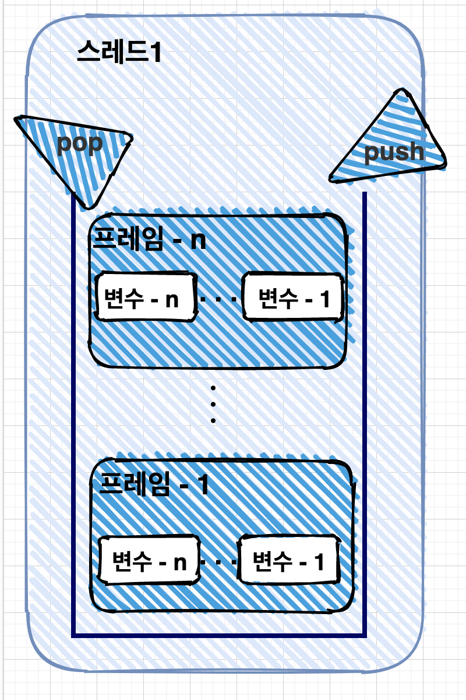
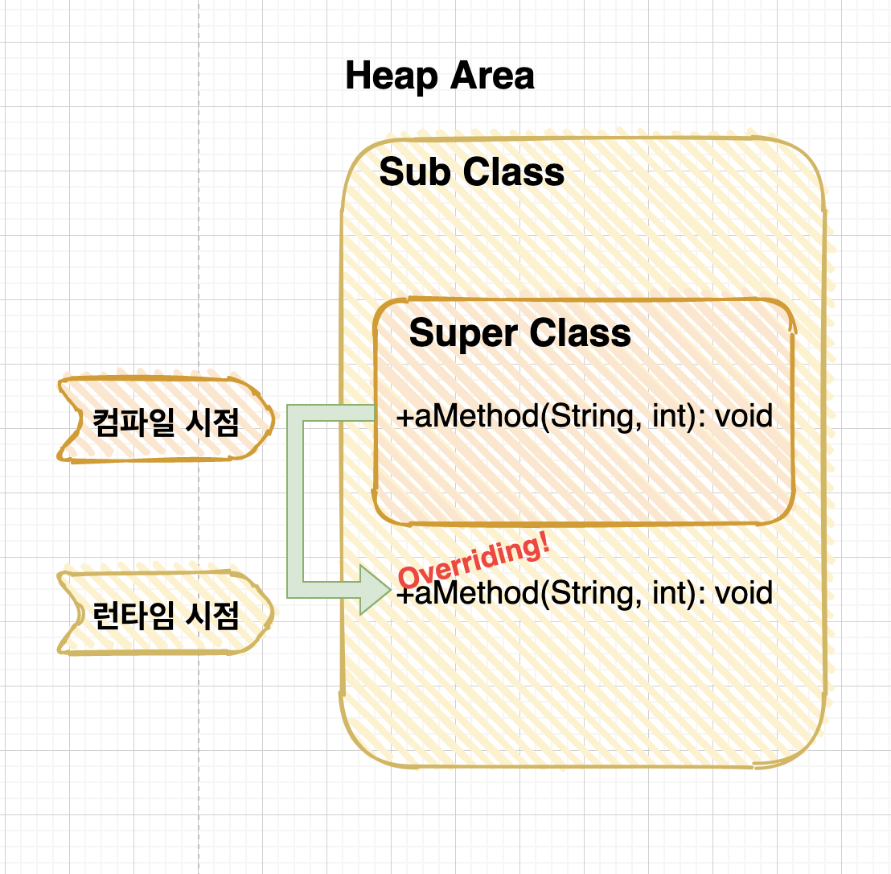

# :ledger: 3주차 - 자바 상속과 다형성
안녕하세요. 멘토 Duck Typing입니다.

3주차 내용정리는 잘 되셨나요? 아주 어렵죠? :dizzy_face:

상속을 이해한다는 것은 OOP가 무엇인지 알고있다는 것입니다.

OOP의 4대 속성을 다시 떠올려볼까요?
1. 추상화
2. 캡슐화
3. 상속
4. 다형성

신인 개발자 면접에서 OOP 4대속성을 많이 물어보는데요. 그 중에서도 특히**다형성**에대한 이해도가 얼마나 높은지 많이 물어봅니다.

이번 주차의 내용이 얼마나 중요한지~ 증말 :cherries:

상속과 형변환, 다형성, 업-다운 캐스팅을 재대로 이해하려면 반드시 메모리 구조를 그릴 수 있어야 합니다.

음.. 어려운 단어 많이 나올 예정입니다. 마음의 준비 되셨나요? :confounded:

> 당충전하고 읽기 준비!

---

###  Index :: 클릭하면 해당 목차로 뿅~!
- [:ledger: 3주차 - 자바 상속과 다형성](#ledger-3주차---자바-상속과-다형성)
    - [Index :: 클릭하면 해당 목차로 뿅~!](#index--클릭하면-해당-목차로-뿅)
    - [JVM 메모리 사용 영역](#jvm-메모리-사용-영역)
    - [상속](#상속)
    - [메소드 오버라이딩](#메소드-오버라이딩)
    - [다형성](#다형성)
    - [캐스팅](#캐스팅)
  - [자료 출처](#자료-출처)

### JVM 메모리 사용 영역
먼저 몸풀기로 JVM의 사용영역부터 정리해 봅시다.

java.exe로 JVM이 시작되면 운영체제에서 할당받은 메모리 영역(Runtime Data Area)을 세부 영역으로 구분해서 사용합니다.


- 메소드 영역(Method Area)

메소드 영역에는 코드에서 사용되는 클래스(.class)들을 클래스 로더로 읽어 클래스 별로 런타임 상수풀, 필드 데이터, 메소드 데이터, 메소드 코드, 생성자 코드 등을 분류해서 저장합니다.

메소드 영역은 JVM이 시작할 때 생성되고 모든 스레드가 공유하는 영역입니다.

- 힙 영역(Heap Area)

힙 영역은 객체와 배열이 생성되는 영역입니다.힙 영역에 생성된 객체와 배열은 JVM 스택 영역의 변수나 다른 객체의 필드에서 참조합니다.

힙메모리는 해당 메모리를 참조하는 변수나 필드가 없다면 GC(Garbage Collector)가 적절한 시점에 해당 메모리를 정리합니다.

- 스택 영역(Stack Area)

JVM 스택 영역은 각 스레드마다 하나씩 존재하며 스레드가 시작될 때 할당됩니다.

자바에서 추가적으로 스레드를 생성하지 않았다면 main 스레드만 존재하므로 JVM스택도 하나입니다.

우리가 엄청 많이 쓴 ```public static void main(String[] args)```이 친구입니다.

JVM스택은 메소드를 호출할 때마다 프레임(Frame)을 추가(push)하고 메소드가 종료되면 해당 프레임을 제거(pop)하는 동작을 수행합니다. (LIFO : Last in Fist Out)

프레임 내부에는 로컬 변수 스택이 있는데, 기본 타입 변수와 참조 타입 변수가 추가(push)되거나 제거(pop)됩니다. 변수가 이 영역에 생성되는 시점은 초기화가 될 때, 즉 최초로 변수에 값이 저장될 때이다.



### 상속
자바의 상속을 알아봅시다!

- 상속이란? 
> 상속이란 상위클래스에서 정의한 필드와 메서드를 하위클래스도 동일하게 사용할 수 있게 물려받는 것입니다.

- 상속을 사용하는 이유
> 코드를 재사용하기에 편하고 클래스 간 계층구조를 분류하고 관리하기 쉬워집니다.

- 자바 상속의 특징
1. 다중상속 금지
자바 클래스는는 단일 상속만 허용됩니다. 다중 상속을 허용하는 언어는 어떤것이 있을까요?

2. 최상위 클래스 : Object
자바의 모든 클래스는 최상위 클래스인 Object클래스는 상속받고있습니다.

클래스선언시 ```extends Object```를 생략해도 컴파일러가 붙여줍니다.

- super 키워드
서브클래스(하위)에서 수퍼클래스(상위)클래스에 접근할 수 있는 키워드입니다.

super키워드는 생성자와 파라미터를 동일하게 사용합니다. 

> 기본생성자(파라미터가 없는 생성자)는 생략해도 컴파일러가 자동으로생성해줍니다. 파라미터가있는 생성자를 선언시에는 기본생성자를 자동으로 추가해주지 않습니다. 원한다면 명시적으로 선언해야 합니다.

생성자가 무엇일까요? 클래스의 정보는 Class Area에 있습니다.

new키워드와 함께 생성자를 사용하게되면, Class Area에 있는 클래스를 정보로 Heap메모리에 객체(인스턴스)를 생성합니다. 


붕어빵틀(클래스)을 만드는 이유는 붕어빵(인스턴스)을 굽기위함이라는거~ 다시 기억을 떠올리면서.

### 메소드 오버라이딩
메소드 오버라이딩이란 무엇일까요? **다형성**의 핵심요소라고 할 수 있는 부분이고, 메소드 오버라이딩을 이해하는게 너무너무너무너무 중요합니다. 이 이해도는 프로그래밍뿐만아니라, 신입개발자 면접에도 많이 나오니, 꼭 정리하고 이해해보시길 바랍니다!


메소드 오버라이딩이란?
> 수퍼클래스가 가지고있는 메서드를 서브클래스에서 새롭게 다른로직으로 정의하고 싶을 때 사용하는 문법입니다.
> 상속관계에 있는 클래스간에 같은 이름의 메서드(정확하게 같은 메소드 시그니처)를 정의하는 문법을 오버라이딩이라고 합니다.
> 오버라이딩 어노테이션은 생략할 수도 있습니다.


메소드 오버라이딩은 **다이나믹 디스패칭**방식으로 동작합니다.

다이나믹 디스패칭이란?

> 컴파일타임에는 알 수 없는 메서드의 의존성을 런타임에 늦게 바인딩하는것.

그림으로 볼까요? 

UML 표기법으로 메소드 시그니처를 표현했습니다. + -> public , : 리턴타입



오버라이딩되고있는 aMethod는 컴파일 시점에는 Super클래스의 내용으로 컴파일되어.class남지만 런타임 시점에 다이나믹 디스패칭 메커니즘으로 SubClass의 aMethod내용으로 동작합니다.

코드로 예시를 볼까요?

```
class A{
    public void aMethod(String arg, int lengh){
        System.out.println("A 클래스의 aMethod");
    }
}
```

```
class ASub extends A{
    public void aMethod(String arg, int lengh){
		System.out.println("B 클래스의 aMethod");
	}
}
```

```
class Main{
    public static void main(String[] args){
        A aSub = new ASub();
        aSub.aMethod("test",4);
    }
}
```

Main클래스에서 aSub변수의 타입은 SuperClass인 A로 선언을 햇지만, 인스턴스 생성은 SubClass인 ASub로 했습니다.

이과정에서, 컴파일 시점에서 Main.class의 출력 내용은 ```A 클래스의 aMethod```입니다.

하지만 실제로 실행될땐 ```B 클래스의 aMethod```이 실행되죠.

이게 바로 다이나믹 디스패칭입니다.

```
class Main{
    public static void main(String[] args){
        ASub aSub = new ASub();
        aSub.aMethod("test",4);
    }
}
```
위 코드처럼 코드를 작성했을땐, 컴파일시점의 결과와 실행시점의 결과는 똑같습니다.

하지만 타입을 A클래스로 선언하고, 구체적인 클래스로 초기화하게되면 이렇게 다형성이 표현되는 것이죠.


다이나믹 디스패칭은 클래스의 상속관계뿐만아니라, 인터페이스, 추상클래스를 구현한 클래스에서도 같은 메커니즘을 사용합니다.

[자세한 내용을 탐구하신 분의 블로그를 추천해드리겠습니다.](https://leemoono.tistory.com/20)

### 다형성
다형성이란 무엇일까요?

 같은 타입이지만 실행 결과가 다양한 객체를 이용할 수 있는 성질을 말합니다.

 코드 측면에서 보면 다형성은 하나의 타입에 여러 객체를 대입함으로써 다양한 기능을 이용할 수 있도록 해준다.

 다형성을 위해 자바는 부모 클래스로 타입 변환을 허용합니다.

 예를 들어볼까요?

 ```
public class Car {
    Tire hankkokTire;
    Tire kumhoTire;
}
 ```
 
 위 코드 처럼 자동차 클래스를 설계할때, 틀을 잡아주는 Tire 클래스를 먼저 설계한다음, 타입으로 사용하여 ```Tire hankkokTire``` 라고 선언해 주고

  ```
public class Car {
    Tire hankkokTire = new HankookTire();
    Tire kumhoTire = new KumhoTire();
}
 ```

위코드처럼 실제사용할 타이어를 대입하면 됩니다.

이런 부모클래스타입으로 타입을 설정해주고, 객체를 생성하면, 자동타입변환(Promotion)이 발생합니다.

```부모클래스 변수 = 자식틀래스타입;```

자동 타입 변환의 개념은 자식은 부모의 특징과 기능을 상속받기 때문에 부모와 동잉하게 취급될 수 있다는 것입니다.


### 캐스팅
Casting이란 무엇일까요?

캐스팅은 강제로 타입변환을 하는 것을 Casting이라고 합니다.

자동타입변환(=자동형변환)은 Upcasting이라고도 표현할 수 있습니다. 

업캐스팅을통해 다형성을 활용한 유연한 프로그래밍을 할 수 있는데요.

코드를 볼까요?

```
public class Driver{
    public void driver(Vehicle vehicle) {
        vehicle.run();
    }
}
```

```
public interface Vehicle {
    public void run();
}
```

```
public class KickBoard implements Vehicle {
    @Override
    public void run(){
        System.out.println("킥보드 휘리릭");
    }
}
```

설계가 끝났으니 실행을 해볼까요?

```
public class Main{
    public static void main(Stirng[] arg){
        Driver driver = new Driver();

        KickBoard kickBoard = new KickBoard();
        Bus bus = new Bus(); // implements Vehicle

        driver.drive(kickBoard);
        driver.drive(bus);
    }
}
```

Driver 클래스의 drive메소드는 Vehicle 타입을 매개변수로 받고있습니다.

Vehicle 인터페이스를 구현한 KickBoard, Bus 구현체는 자동 타입변환됩니다.

```Vehicle vehicle = kickBoard```,```Vehicle vehicle = bus```

업캐스팅은 명시적으로 캐스팅 선언을 하지 않아도 됩니다.

DownCasting은 명시적으로 타입을 지정해야 합니다. ```구현클래스 변수 = (구현클래스) 인터페이스변수; 

다운캐스팅은 SubClass에서 구현한 추가 메소드를 사용하기위해 사용합니다.

다이나믹 디스패칭이 이루어지면서 컴파일시점에 잡지못하는 런타임 익셉션이 발생할 수 있습니다.

다운캐스팅에 관련된 Exception은 ```ClassCastException```으로 발생합니다.

런타임 익센션은 애플리케이션의 전체동작을 중단시키기 때문에, 반드시 잘 다뤄야하는 내용입니다.

이렇게 혼동될 수 있는 객체를 구별하기 위해 도움을 주는 연산자가 ``ìnstanceof``연산자 입니다.

Java 11부터는 이 ```instanceof``연산자가 deprecated가 되었는데요.

그렇다면 어떻게 타입을 검사할까요?


## 자료 출처
- [javatutorial.net](https://javatutorial.net/jvm-explained)