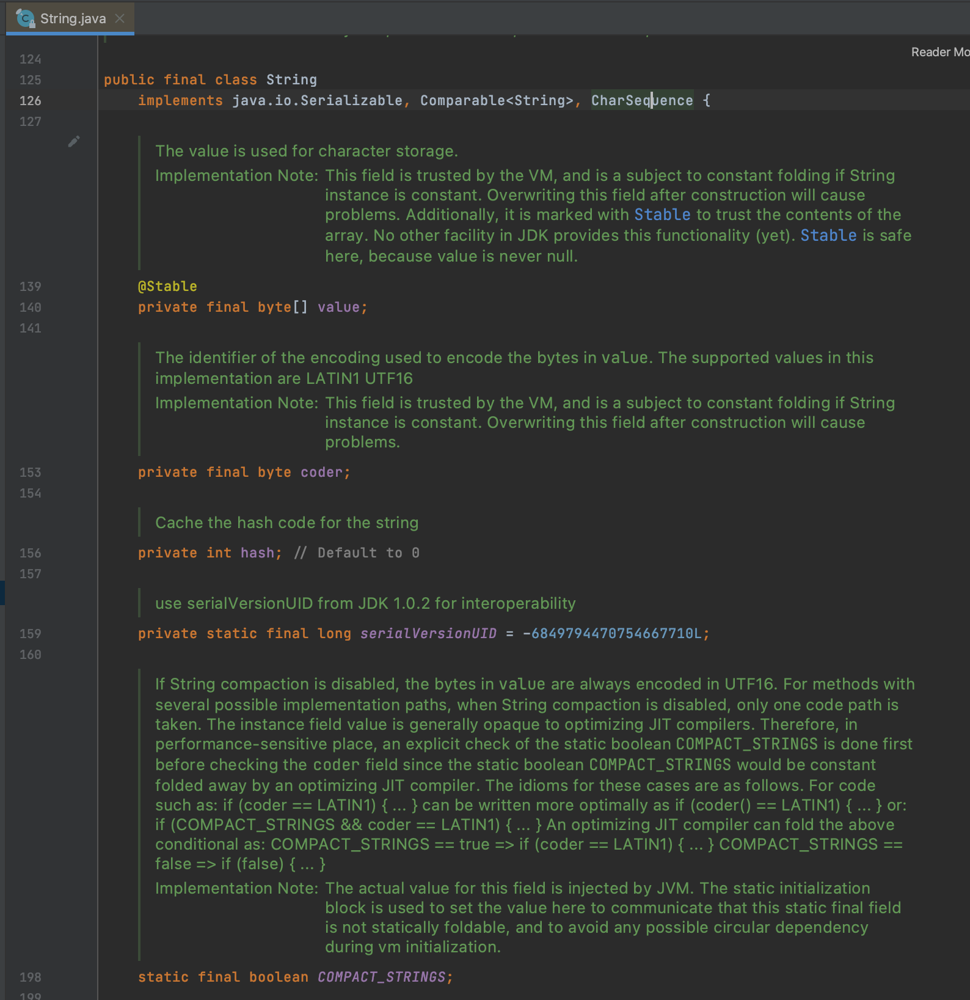

# :ledger: 3주차 - 자바 객체지향 프로그래밍
안녕하세요. 멘토 Duck Typing입니다.

3주차 내용정리는 잘 되셨나요? 아주 어렵죠? :dizzy_face:

입문자인 여러분들은 꼼꼼히 공부해보시고, '아! 이런거구나!', '아! 이렇게 쓰는 것이구나', '이렇게 동작을 하는 이유가 이렇기 때문이구나'에 초점을 두고 공부하시면 큰 도움이 됩니다. :smile:

차근차근 프로그래밍 경험치를 올리면서 어려운 내용을 이해할 수 있는 베이스를 깔고 점점 살을 붙여나가는 것이 중요합니다.


예를 들어서 수학을 배울 때, 방정식을 모르는데 미분적분을 할 수 없듯이. 제곱근이 뭔지모르는데 삼각함수를 풀려고 하는 것과 같은 맥락이죠.

절대로 조급해하시지 말고, 자바를 탄탄히 공부하세요! :yum:


앞으로 배우게될 Spring이라는 Framework는 3가지의 핵심 철학이자 요소가 있는데요. 

그것은 바로 IoC(제어의 역전), AOP(절차지향 프로그래밍), POJO(순수 자바객체 사용)입니다.

갑자기? :dizzy_face: IoC, AOP는 나중에 배우게 될 것이고 (말만 들어도 어렵죠?)

여기서 가장 중요한 부분은 **POJO**입니다. 스프링을 사용하더라도 프레임워크 기능을 사용하기 보다. 순수 자바로 코드를 짜도록 권고한다는 내용인데요.

이말은, 자바를 제대로 하지않고 스프링 프레임워크를 사용한다는것은 말도 안된다는 말입니다. :neckbeard:

제곱근을 배우지않고 삼각함수문제를 푼다는 것과 같은 이야기이죠!

실제로, 자바공부를 대충하고 빨리 프로젝트를 만들고싶어서 스프링부터 뚜둘뚜둘하시는 입문자들이 많은데요.

반드시 다시 돌아와서 자바공부를 하게될 겁니다. 자바가 탄탄하지않으면 아무것도 만들 수 없습니다. 


> 반드시 많이 생각해보시고 스스로 정리하시고 계속해서 살을 붙여나가보세요!

---

###  Index :: 클릭하면 해당 목차로 뿅~!
1. [Object](#Object)
2. [String](#String)
3. [Wrapper Class](#wrapper-class)
4. [배열](#접근제어자)
5. [컬렉션](#collection)
6. [내부 클래스](#inner-class)
7. [람다](#lambda)
8. [스트림](#stream)
9. [추가자료](#추가-자료)
10. [참고자료](#참고-자료)

- Object, String, Wrapper, Generic, Collection, Inner Class, Lambda, Stream

### Object
Object.class는 자바의 모든 클래스가 상속받고있습니다. 그래서 클래스이름 뒤에 ```extends Object```를 생략해도, 컴파일러가 붙여줍니다.

상속을 배우셨으니, 이 의미는 모든 클래스는 Object의 메소드를 바로 사용할 수 있다는 뜻이겠죠?

공통기능을 설계한다는 것은 참 골치 아픈일입니다.:dizzy_face:

Object는 어떤 메소드가 있을까요?

Object는 총 11개의 메소드를 가지고 있습니다. 어떤 메소드가 있을까요?

[Java 8 공식 사이트](#https://docs.oracle.com/javase/8/docs/api/)

공식싸이트에 들어가서 왼쪽 상단의 java.lang 패키지를 선택하면 왼쪽 하단에서 Object클래스를 눌러볼 수 있습니다.

Object클래스에서 여러분들이 반드시 정리해야하는 메소드는 1. toString() 2. equals() 3. clone 입니다.

나중에 배울 Thread 관련 메소드도 미리 예습해도 됩니다.

### String
String 은 클래스입니다. java.lang.String 으로 제공되죠!

신입개발자들에게 String 타입변수와 primitive 타입 변수들과 자주 비교되며, 차이점을 많이 물어봅니다. 꼭 정리하세요!

String인스턴스 특이한 친구입니다. String 인스턴스는 Immutable 속성을 갖는데요.

Immutable 즉 불변 객체를 뜻하는데요, 한번 값이 할당되면 재할당이 안된다는 말입니다.

IDE(Eclipse 등)에서 디컴파일을 지원한다면 Java API를 직접 열어볼 수 있습니다.

String의 코드를 볼까요?



String의 필드에 private 접근제어자와 final 키워드가 붙어있는 친구들을 잘봐야 합니다.

final키워드를 사용하면 생성자에서 반드시 필드에 값을 세팅해야하며, 생성자에서 할당 코드가없으면 컴파일 에러가 발생합니다!

String 클래스는 생성한 인스턴스를 읽을 수만있을 뿐, 값을 읽을 수 없습니다. 

String 클래스는 워낙 많이 사용되서 특별한 메소드도 제공되는데요.

[Java 8 공식 사이트](#https://docs.oracle.com/javase/8/docs/api/)

마찬가지로 공식싸이트에 들어가서 왼쪽 상단의 java.lang 패키지를 선택하면 왼쪽 하단에서 String 클래스를 눌러볼 수 있습니다.

String클래스에서 여러분들이 반드시 정리해야하는 메소드는 1. charAt() 2. compareTo() 3. concat, 4. indexOf(), 5. trim() 입니다.

String 클래스의 private final 필드 중에 ```byte[] value```라는 친구를 이용해 다양한 기능을 제공합니다.

하나더! Immutable Object 와 Mutable Object 정리해야 할것같죵?!

### Wrapper Class
Wrapper Class는 왜 있는 걸까요?

자바가 순수한 객체지향언어가 아니라고 주장하는 논리는 바로 primitive type의 존재 때문인데요.

순수한 객체지향 언어라고 불리는 Python은 int형을 재정의해서 사용할 수 있습니다.

하지만, 자바는 int형을 재정의해서 사용할 수 없습니다.

그래서 이런 primitive type을 객체로 취급해야할 때, Wrapper Class를 사용하게 됩니다.

Wrapper 클래스는 8가지 primitive type에 맞추어 8가지의 Wrapper Class가 존재합니다.

여기서 primitive type <-> Wrapper Class 사이의 Boxing과 UnBoxing개념이 튀어나오죠!

이부분은 여러분이 코드를 짜시면서 보는것이 더 와 닿습니다~.

자바 5버전부터 이런 불편함을 덜기위해 컴파일러가 AutoBoxing 과 AutoUnBoxing 슧삭 해준답니다~

[참고하기 좋은 자료 : TCP School](http://www.tcpschool.com/java/java_api_wrapper)

### Generic Programming
제네릭 프로그래밍은 굉장히 어려운 내용입니다.

인문자 여러분들은 컴파일 시에 미리 타입 검사를 수행해 에러를 방지할 수 있다. 라고 생각하시면 됩니다.

제네릭은 자바 코드에서 개발자에의해 선언되고 사용된 제네릭 타입은 컴파일러에 의해 자동으로 검사되어 타입 변환이 됩니다.

그리고 컴파일된 .class파일에는 제네릭타입이 제거되어 보입니다.

제네릭은 실습을 하면서 직접 코딩을 해보며, 클래스의 타입을 선언하며 감각을 익히시는게 더 효과적입니다.

### Collection
저번주에 잠깐나온 Collection! 이번엔 제대로 공부하셨나요?

Collection Framework의 대표 인터페이스인 1. List 인터페이스, 2. Set 인터페이스, 3. Map 인터페이스의 각 특징을 꼭 알고계셔야합니다.

신입 개발자분들에게 면접질문 내용으로 나올 수 있고, 알고리즘 문제 당골 출제내용이이까요!

### Inner Class
### Lambda
### Stream