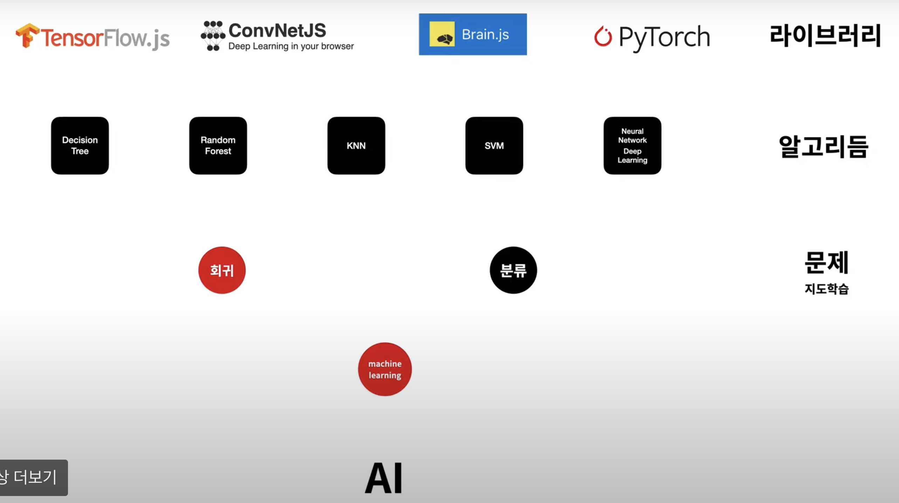

# 머신러닝 야학!
10일동안 진행하는 머신러닝 야학!
머신러닝을 놓은지 1년이 넘어가니.. 따라가질 못하겠다.
야금야금 공부해보자!

## Index
- [머신러닝 야학!](#머신러닝-야학)
  - [Index](#index)
  - [텐서플로우 JavaScript](#텐서플로우-javascript)
    - [지도학습의 작업순서](#지도학습의-작업순서)
  - [텐서플로우 Python](#텐서플로우-python)
  - [Tensorflow 이미지 분류 - CNN](#tensorflow-이미지-분류---cnn)

## 텐서플로우 JavaScript

### 지도학습의 작업순서
  1. 과거의 데이터를 준비한다.
        
        ex. 날씨 온도와 레모네이드 판매량의 원인 결과 -> 판매량 예측

  2. 모델의 모양을 만든다.
    
  3. 데이터로 모델을 학습(FIT)한다.

  4. 모델을 이용한다.

 -> 코드로 어떻게 할까?
 
 2. 번 과정(모델 만들기) 전에 할 수 있는 방법들
  
  - 기존 모델 실행 : 바로 사용할 수 있는 자바스크립트 모델을 사용하거나, 브라우저또는 Node.js에서 실행할 수 있도록 Python TensorFlow 모델을 변환

  - 기존 모델 다시 학습시키기 : 자체 데이터를 사용하여 기존 ML 모델을 다시 학습

  - 자바스크립트로 ML 개발 : 유연하고 직관적인 API를 사용하여 자바스크립트로 직접 모델을 빌드하고 학습

## 텐서플로우 Python

## Tensorflow 이미지 분류 - CNN